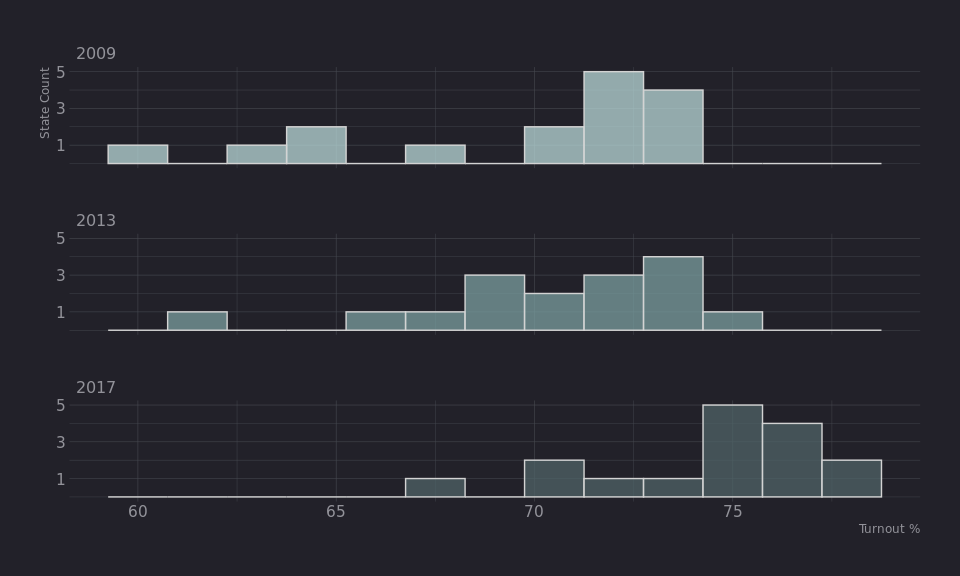
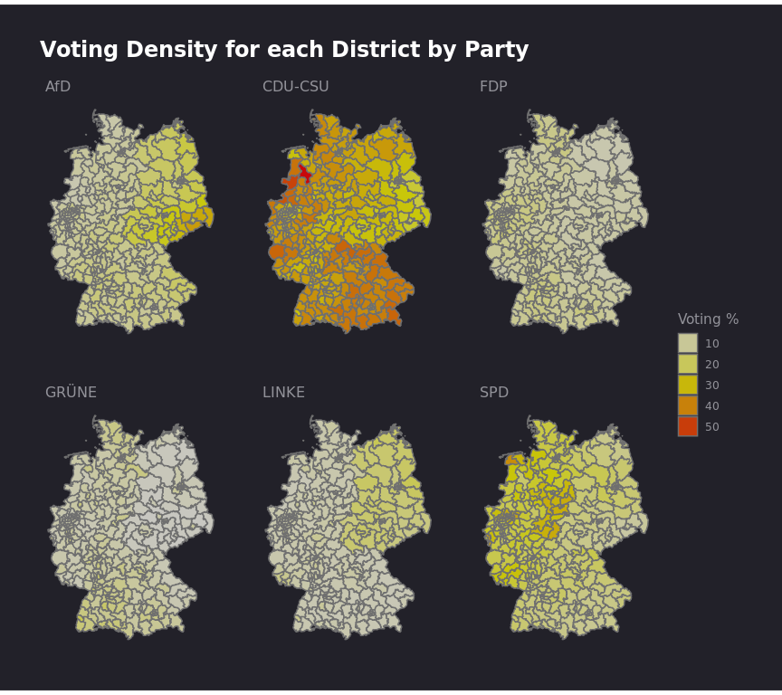
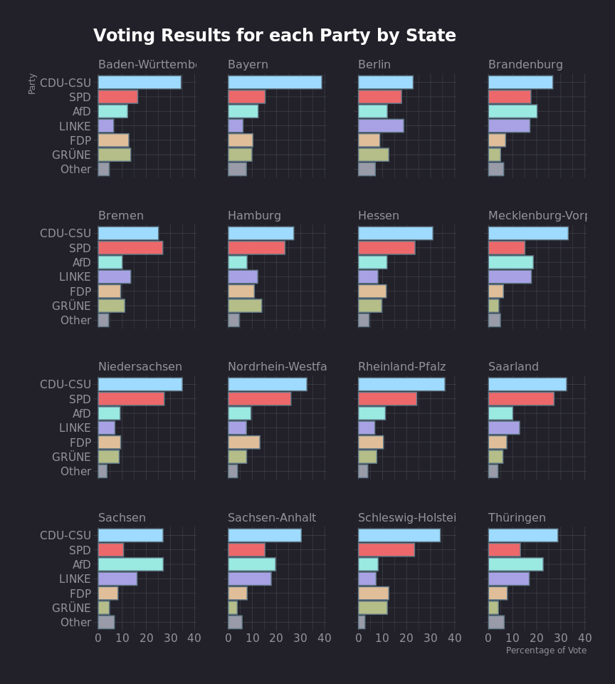

German Election 2017
================

# Import libraries

``` r
library(data.table)
library(ggplot2)
library(hrbrthemes)
library(magrittr)
library(sf)

# Helper addition to theme to match website background
change_background <- function(plt) {
  bkgrnd <- "#222129"
  plt <- plt + theme(rect = element_rect(fill = bkgrnd, color = bkgrnd)) + 
        theme(plot.background = element_rect(fill = bkgrnd, color = bkgrnd)) + 
        theme(panel.background = element_rect(fill = bkgrnd, 
            color = bkgrnd)) + theme(rect = element_rect(fill = bkgrnd, 
        color = bkgrnd))
  plt
}
```

# Import and Prep Data

``` r
# Read in Geographic Shape data for Germany
germany <- sf::read_sf("data/Geometrie_Wahlkreise_19DBT_VG250_geo.shp") %>%
  sf::st_set_crs(4326) %>%
  sf::st_transform(crs=31467) %>%
  data.table::as.data.table()

# Read in Overall Election Data
overall <- data.table::fread("data/2017_german_election_overall.csv")

# Aggregate voting data by State
voting_pct <- overall[,
    .(voters = sum(registered.voters),
      votes  = sum(valid_second_votes)),
    by = state
]
# Calculate voting_pct
voting_pct[, voting_pct := round(votes / voters, 3) * 100]

# Join voting data to map data
germany <- merge(germany, voting_pct, by.x = "LAND_NAME", by.y = "state", all.x = TRUE)

# Using sf::st_union() show only the borders of states
state_map <- germany[, .(geometry = sf::st_union(geometry)), by = LAND_NAME]

# Join voting % data
state_map <- merge(state_map, voting_pct, by.x = "LAND_NAME", by.y = "state", all.x = TRUE)
```

# Plot Voter Turnout

## Map

``` r
# Map of Voting % among registered voters
map_vote <- state_map %>% 
  ggplot() +
  geom_sf(aes(fill=voting_pct, geometry=geometry), colour="white", lwd=.25, alpha=0.85) +
  ggtitle("Voter Turnout by State", 
          "Lower Turnout in Former East Germany") +
  scale_fill_distiller(type = "div", palette = "Spectral") +
  guides(fill=guide_legend(title="Voting %")) +
  hrbrthemes::theme_ft_rc() +
  theme(legend.position = "bottom",
        plot.title = element_text(hjust=0.5),
        plot.subtitle = element_text(hjust=0.5),
        axis.text.x = element_blank(),
        axis.text.y = element_blank(),
        panel.grid.major = element_blank())

change_background(map_vote)
```

<!-- -->

## Histogram

``` r
# Past Turnout Numbers 
bundesland <- c("Schleswig-Holstein","Mecklenburg-Vorpommern","Hamburg", "Niedersachsen",
                "Bremen","Brandenburg", "Sachsen-Anhalt", "Berlin", "Nordrhein-Westfalen",
                "Sachsen", "Hessen", "Thüringen", "Rheinland-Pfalz", "Bayern", "Baden-Württemberg", "Saarland")
pct_2013 <- c(73.1, 65.3, 70.3, 73.4, 68.8, 68.4, 62.1, 72.5, 72.5, 69.5, 73.2, 68.2, 72.8, 70.0, 74.3, 72.5)
pct_2009 <- c(73.6, 63.0, 71.3, 73.3, 70.3, 67.0, 60.5, 70.9, 71.4, 65.0, 73.8, 65.2, 72.0, 71.6, 72.4, 73.7)
past_df <- data.table(bundesland=bundesland, pct_2013=pct_2013, pct_2009=pct_2009)

# Join past data to current
voting_pct <- merge(voting_pct, past_df, by.x = "state", by.y = "bundesland", all.x = TRUE)

# Rename columns
turnout <- voting_pct[, .(Bundesland=state, `2017`=voting_pct, `2013`=pct_2013, `2009`=pct_2009)]

# Reshape long ways
reshaped <- turnout %>% 
  melt(measure.vars=2:4, variable.name="Year", value.name="Percentage", 
       variable.factor=FALSE)

# Histogram of turnout
turnout_hist <- reshaped %>%
  ggplot(aes(x=Percentage, fill=Year)) +
  geom_histogram(binwidth=1.5, colour="lightgrey", alpha=0.75) +
  facet_wrap(~Year, ncol = 1) +
  scale_fill_manual(values=c("#b8d8d8","#7a9e9f", "#4f6367")) +
  scale_y_continuous(breaks = c(1, 3, 5)) +
  xlab("Turnout %") + ylab("State Count") +
  hrbrthemes::theme_ft_rc() +
  theme(legend.position = "none")

change_background(turnout_hist)
```

<!-- -->

``` r
# Line Plot
lineplot <- reshaped %>%
  ggplot(aes(as.integer(Year), Percentage, colour=Bundesland, group=Bundesland)) +
  geom_line() +
  xlab("Election Year") +
  scale_x_continuous(breaks=c(2009, 2013, 2017)) +
  hrbrthemes::theme_ft_rc() +
  theme(legend.position = "none")

change_background(lineplot)
```

<!-- -->

# Party Distribution by Region

## Map

``` r
# Parties that we want to analyze
top_parties <- c(
  "Christlich.Demokratische.Union.Deutschlands", 
  "Christlich.Soziale.Union.in.Bayern.e.V.",
  "Sozialdemokratische.Partei.Deutschlands",
  "Alternative.für.Deutschland", "BÜNDNIS.90.DIE.GRÜNEN", 
  "Freie.Demokratische.Partei", "DIE.LINKE"
)

# Load party data and change parties no in top parties to "Other"
party <- data.table::fread("data/2017_german_election_party.csv")
party[, party := ifelse(!party %in% top_parties, "Other", party)]

# Group party data by area_name
total_votes <- party[, .(total_votes = sum(votes_second_vote)), by = .(state, area_name)]

# Group party data by by area and party
total_party <- party[, .(party_votes = sum(votes_second_vote)), by = .(state, area_name, party)]

# Join total.votes & total.party and calculate percentage
party_votes <- merge(total_party, total_votes, all.x = TRUE)
party_votes[, party_pct := round(party_votes / total_votes, 4) * 100]

# Append "Other" to top.parties
top_parties <- append(top_parties, "Other")

# Shorthand party names
party_names <- c("CDU-CSU", "CDU-CSU", "SPD", "AfD", "GRÜNE", "FDP", "LINKE", "Other")

# Data frame to join to voting data
names <- data.table(
  party = top_parties,   # full names
  Party = party_names    # shorthand names
)

# Join Shortened Party names to voting data and filter out 0 results
party_votes <- merge(party_votes, names, by = 'party', all.x = TRUE)
party_votes[, WKR_NAME := gsub("\\s–\\s", "-", area_name)]
party_votes <- party_votes[party_votes > 0]

# Read in Geographic Shape data for Germany and merge geo with votes
party_map <- sf::read_sf("data/Geometrie_Wahlkreise_19DBT_VG250_geo.shp") %>% 
  sf::st_set_crs(4326) %>%
  sf::st_transform(31467) %>%
  data.table::as.data.table()
party_map[, WKR_NAME := gsub("\\s\u0096\\s", "-", WKR_NAME)]
party_map <- merge(party_map, party_votes, by = "WKR_NAME", all.x = TRUE)

# Map of voting 
party_plt <- party_map[Party != "Other"] %>%
    ggplot() +
    geom_sf(aes(fill=party_pct, geometry=geometry), colour="#6f6f6f", alpha=0.75) +
    scale_fill_gradient2(
      low="white", mid="yellow", high="red", midpoint = 27
    ) +
    facet_wrap(~Party, ncol=3) +
    ggtitle("Voting Density for each District by Party") +
    guides(fill=guide_legend(title="Voting %")) +
    hrbrthemes::theme_ft_rc() +
    theme(
        axis.text.x = element_blank(),
        axis.text.y = element_blank(),
        panel.grid.major = element_blank()
    )

change_background(party_plt)
```

<!-- -->

## Boxplots

``` r
# Colors to associate with parties
party_colors <- c(
  "#9aeae2", "#9edbff", "#dfbe99", "#b5bd89", "#a8a2e5", "#999ba8", "#ed686a"
  )
# Boxplot
boxplts <- party_map %>% 
  ggplot(aes(Party, party_pct)) +
  geom_jitter(colour="#6f6f6f", alpha=0.7) +
  geom_boxplot(aes(colour=Party), alpha=0.5, size=1) +
  ggtitle("Percentage of Votes among Districts by Party",
  "Each point is the % of the district that voted for a particular party") +
  xlab("Party") + ylab("Percentage of Vote") +
  scale_color_manual(values=party_colors) +
  hrbrthemes::theme_ft_rc() +
  theme(legend.position = "none")

change_background(boxplts)
```

<!-- -->

## Barcharts

``` r
# Aggregate State Votes by Party
state_party_votes <- party_votes[,
    .(party_votes = sum(party_votes)),
    by = .(state, Party)
]

# Aggregate Votes by State
state_total_votes <- state_party_votes[,
    .(total_votes = sum(party_votes)),
    by = state
]

# Calculate the Pct of Votes by Party
state_pct_votes <- merge(state_party_votes, state_total_votes, all.x = TRUE)
state_pct_votes[, party_pct := round(party_votes / total_votes, 3) * 100]

# Plot bar charts for each State
bar_charts <- state_pct_votes %>% 
  ggplot(aes(reorder(Party, party_pct), party_pct, fill=Party)) +
  geom_bar(stat="identity") +
  ggtitle("Voting Results for each Party by State") + 
  xlab("Party") + ylab("Percentage of Vote") +
  facet_wrap(~state, ncol=4) +
  coord_flip() +
  scale_fill_manual(values=party_colors) +
  hrbrthemes::theme_ft_rc() +
  theme(legend.position = "none")

change_background(bar_charts)
```

<!-- -->
