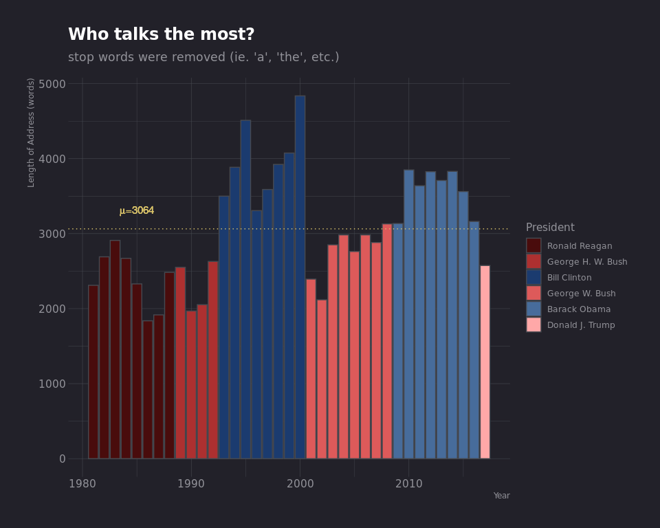
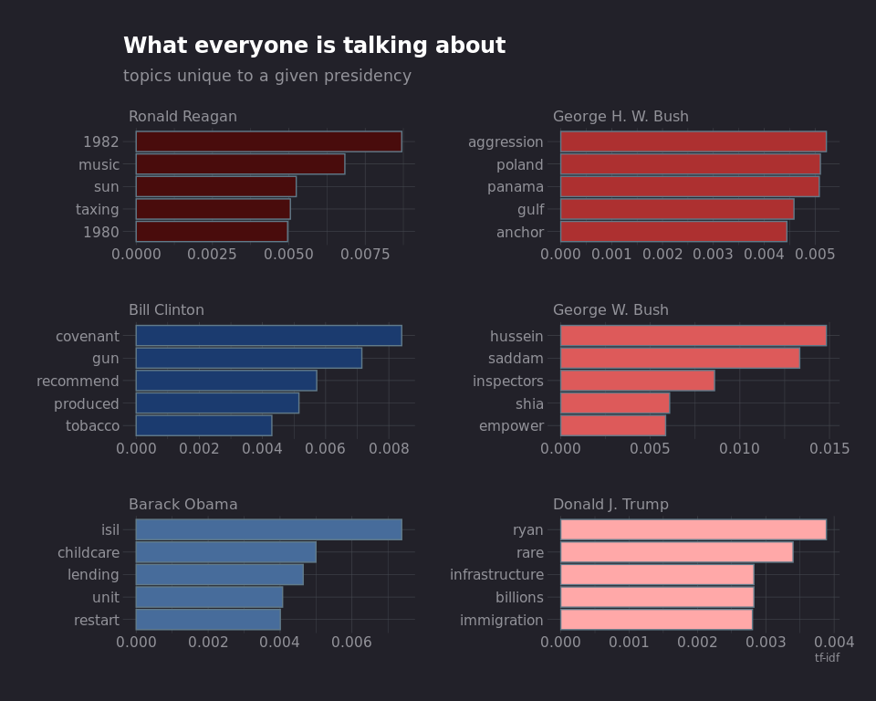
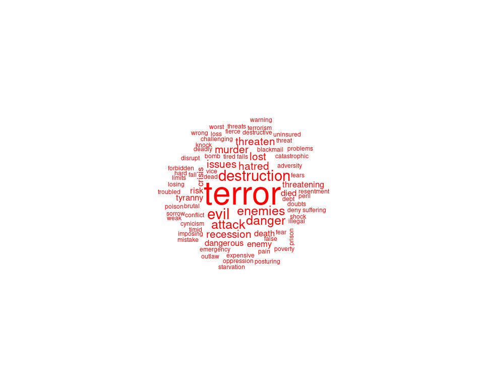
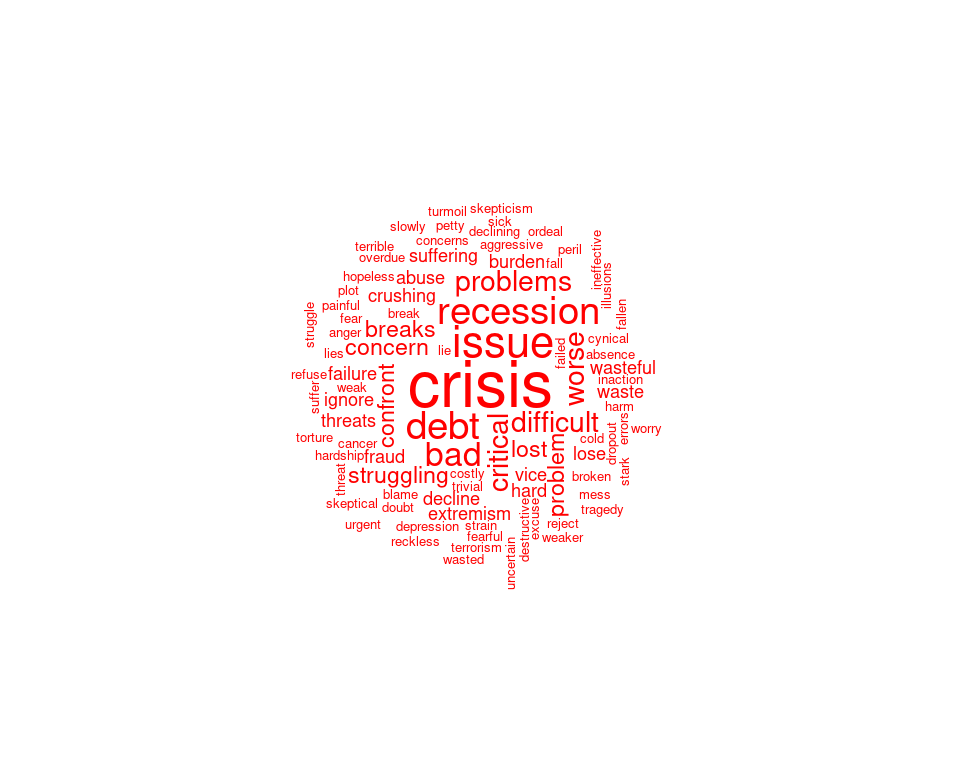

State of the Union
================

# Import libraries

``` r
library(data.table)
library(ggplot2)
library(hrbrthemes)
library(magrittr)
library(tidytext)
library(tm)
library(wordcloud)

# Helper addition to theme to match website background
change_background <- function(plt) {
  bkgrnd <- "#222129"
  plt <- plt + theme(rect = element_rect(fill = bkgrnd, color = bkgrnd)) + 
        theme(plot.background = element_rect(fill = bkgrnd, color = bkgrnd)) + 
        theme(panel.background = element_rect(fill = bkgrnd, 
            color = bkgrnd)) + theme(rect = element_rect(fill = bkgrnd, 
        color = bkgrnd))
  plt
}
```

# Import and Prep Data

``` r
# Read in data
union <- data.table::fread("data/StateOfUnion.csv", sep="|")

# make President column an ordered factor
president_order <- c("Ronald Reagan", "George H. W. Bush",
                     "Bill Clinton", "George W. Bush",
                     "Barack Obama", "Donald J. Trump")
colors = c("#490c0c","#ad3030","#1b3b6f","#dd5a5a","#476c9b","#ffa8a8")
union[, President := factor(President, levels=president_order)]

str(union, give.attr=FALSE)
```

    ## Classes 'data.table' and 'data.frame':   37 obs. of  4 variables:
    ##  $ President: Factor w/ 6 levels "Ronald Reagan",..: 6 5 5 5 5 5 5 5 5 4 ...
    ##  $ Year     : int  2017 2016 2015 2014 2013 2012 2011 2010 2009 2008 ...
    ##  $ Party    : chr  "Republican" "Democrat" "Democrat" "Democrat" ...
    ##  $ Address  : chr  "Thank you very much. Mr. Speaker, Mr. Vice President, Members of Congress, the First Lady of the United States,"| __truncated__ "Mr. Speaker, Mr. Vice President, Members of Congress, my fellow Americans: Tonight marks the eighth year that I"| __truncated__ "Mr. Speaker, Mr. Vice President, Members of Congress, my fellow Americans: We are 15 years into this new centur"| __truncated__ "Mr. Speaker, Mr. Vice President, Members of Congress, my fellow Americans: Today in America, a teacher spent ex"| __truncated__ ...

# Create Corpus

``` r
# Read in Address column as corpus
corpus <- tm::Corpus(tm::VectorSource(union$Address))

# Remove punctuation
corpus <- corpus %>% 
  tm_map(removePunctuation) %>% 
  tm_map(removeWords, c(stopwords("en")))

# Convert to term-document matrix
frequencies <- tm::DocumentTermMatrix(corpus)

# Spread unique words into a sparse matrix and count frequencies
sparse <- tm::removeSparseTerms(frequencies, sparse = 0.95)

# Convert back to data.table
union_sparse <- as.data.table(as.matrix(sparse))
```

# Tidy Data

``` r
# Go from sparse data frame to narrow and filter out zero values
union_combined <- union[, !"Address"] %>%
  cbind(union_sparse) %>%
  melt(measure.vars=4:NCOL(union_sparse)+3, variable.name="word", value.name="count") %>%
  .[count > 0]
```

# Average Word Count per Address

``` r
# Calculate total words for each address
address_length <- union_combined[, .(Total = sum(count)), by = .(President, Year)]

# Calculate average word count
avg_count <- round(mean(address_length$Total))

# Plot data
address_plt <- address_length %>% 
  ggplot(aes(Year, Total, fill = President)) +
  geom_bar(stat = "identity", colour = "#464950") +
  geom_hline(yintercept = mean(address_length$Total),
             colour = "#dbc469", linetype="dotted") +
  ggplot2::annotate("text", x=1985, y=3300, 
                    label=bquote(paste(mu, "=", .(avg_count))),
                    color="#dbc469", size=4) +
  ggtitle("Who talks the most?",
          subtitle="stop words were removed (ie. 'a', 'the', etc.)") +
  ylab("Length of Address (words)") +
  scale_fill_manual(values=colors) +
  hrbrthemes::theme_ft_rc()

change_background(address_plt)
```

<!-- -->

# Top Words by Presidency

``` r
# Calculate tf_idf
union_tf_idf <- union_combined %>% 
  bind_tf_idf(word, Year, count)

# Get top 5 topics
president_tf_idf <- setorder(setDT(union_tf_idf), President, -tf_idf)[,
  indx := seq_len(.N), by = President][indx <= 5]

# Plot tf_idf by president
president_plt <- president_tf_idf %>%
  ggplot(aes(reorder(word, tf_idf), tf_idf, fill = President)) +
  geom_col(show.legend = FALSE) +
  labs(x = NULL, y = "tf-idf") +
  scale_fill_manual(values = colors) +
  facet_wrap(~President, ncol = 2, scales = "free") +
  coord_flip() +
  ggtitle("What everyone is talking about",
          "topics unique to a given presidency") +
  hrbrthemes::theme_ft_rc()

change_background(president_plt)
```

<!-- -->

# Negative Sentiment and Wordclouds

## September 11th

``` r
# filter for year 2002
negative_911 <- merge(union_combined[Year == 2002], get_sentiments("bing"))[sentiment == "negative"]

# plot 911 wordcloud
wordcloud(negative_911$word, negative_911$count, min.freq = 1, colors = "red", random.order=FALSE)
```

<!-- -->

## Financial Crash

``` r
# filter for year 2009
negative_crash <- merge(union_combined[Year == 2009], get_sentiments("bing"))[sentiment == "negative"]

# plot crash wordcloud
wordcloud(negative_crash$word, negative_crash$count, min.freq = 1, colors = "red", random.order=FALSE)
```

<!-- -->
